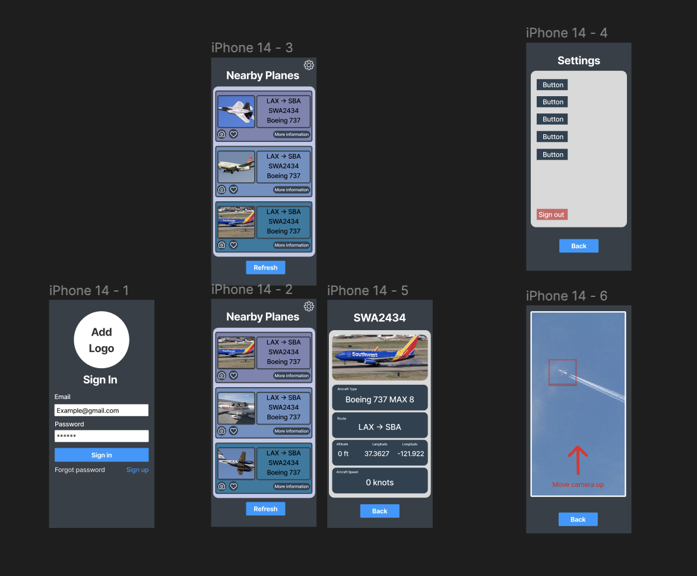
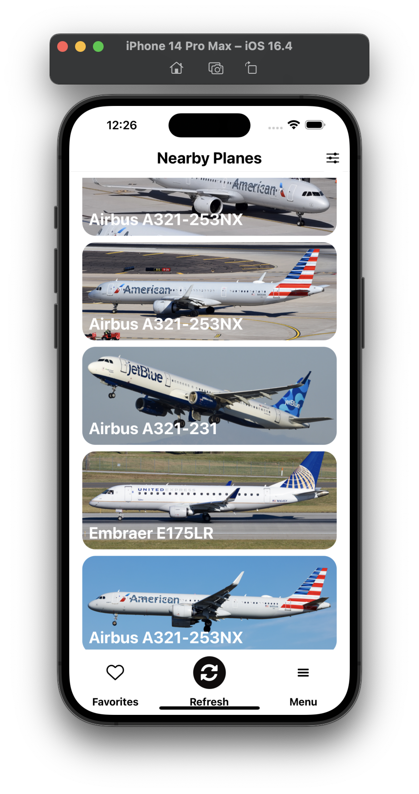

# Airnet

Welcome to AirNet, the flight tracking app that helps people gather flight information nearby. Our mission is to connect the sky by providing the most accurate and up-to-date information on flight schedules and status to our users.

## About Our Team

### Our Founders

AirNet was founded in 2023 by Gen Tamada, Ray Du, Tommy So, and Bryce Wang. Since then, we've been working hard to create a seamless and user-friendly experience for our users. Our team is made up of passionate individuals who are dedicated to providing you with the best possible experience. Thank you for choosing AirNet and we hope you enjoy using our app. If you have any questions or feedback, please don't hesitate to contact us.

## Table of Contents

- [Installation](#installation)
- [Usage](#usage)
- [Our Journey](#our-journey)
- [Credits](#credits)


## Installation

Provide instructions on how to install and set up your project, including any dependencies that need to be installed.

1. Clone this repository:
```shell
$ git clone https://github.com/Ononymous/AirNet.git
```
2. Change into the project directory:
```shell
$ cd your-project
```
3. Install dependencies:
```shell
$ npm install
```
4. Start the app:
```shell
$ npm start
```

## Usage

Provide examples and instructions on how to use your project.
- Live tracking of up to 30 planes in your area
- Displays plane info such as location, speed, and type
- Allows users to sign in and save their favorite planes for future tracking
- Filters planes by distance, speed, and other criteria


## Our Journey

We started our journey by coming up with a design using [Figma](https://www.figma.com/file/YMjlqVdLgLOY0CEvBPn5Dx/AirNet?t=KbLNHAjL61YLaZ0a-1), a tool for front-end design. We used this as a guide to implement our front-end design.
<br>
<br>
Here is a screenshot of our first design:

<br>
<br>
Final design:

<br>
<br>
[Click Here](https://docs.google.com/presentation/d/13k8u5GwKJcpTi3HXs5ICFjLOTZJt4VP88dQwsHjMpXA/edit?usp=sharing) to view our mid-point presentation slides.

[Click Here](https://www.canva.com/design/DAFhz1USANU/KwKERXrIxxzKBm-GShMLpQ/view?utm_content=DAFhz1USANU&utm_campaign=designshare&utm_medium=link&utm_source=publishsharelink) to view our final showcase presentation slides.

## Credits

Acknowledge any resources or collaborators you used for your project.

